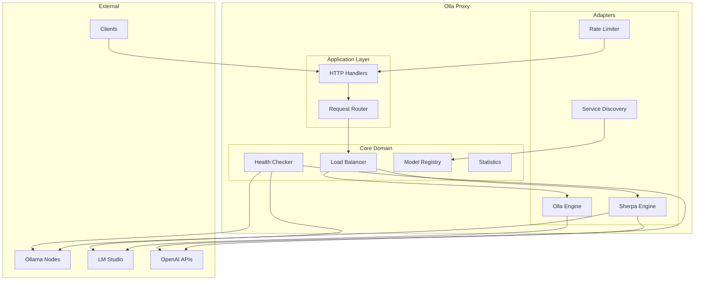
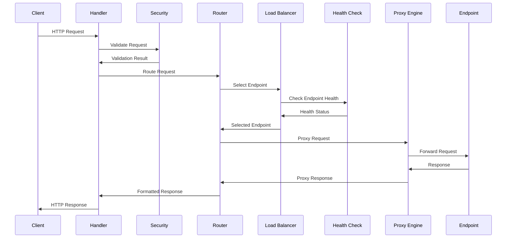
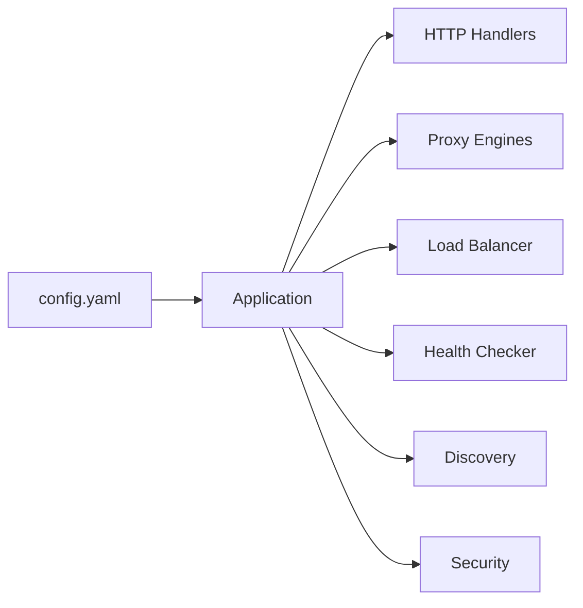

# Architecture

Olla follows **Hexagonal Architecture** (Ports & Adapters) principles, ensuring clean separation of concerns, testability, and maintainability.

## High-Level Architecture



## Hexagonal Architecture Implementation

### Layer Structure

```
┌─────────────────────────────────────────────────────────┐
│                    External Clients                      │
│         (CLI, API Clients, OpenWebUI, Continue)         │
└─────────────────────────┬───────────────────────────────┘
                          │
┌─────────────────────────▼───────────────────────────────┐
│                   Application Layer                      │
│                  (HTTP Handlers, Routes)                 │
│                   internal/app/handlers                  │
└─────────────────────────┬───────────────────────────────┘
                          │
┌─────────────────────────▼───────────────────────────────┐
│                      Core Domain                         │
│              (Business Logic, Entities, Ports)           │
│                     internal/core                        │
└──────┬──────────────────────────────────────┬───────────┘
       │                                      │
┌──────▼────────────┐                ┌───────▼───────────┐
│   Adapter Layer   │                │   Adapter Layer   │
│  (Proxy Engines)  │                │ (Load Balancers)  │
│ internal/adapter  │                │ internal/adapter  │
└───────────────────┘                └───────────────────┘
       │                                      │
┌──────▼────────────────────────────────────▼────────────┐
│                 External Systems                        │
│        (Ollama, LM Studio, vLLM, OpenAI API)          │
└─────────────────────────────────────────────────────────┘
```

### Key Principles

- **Dependencies point inward**: Core has no dependencies on outer layers
- **Ports define contracts**: Interfaces in core, implementations in adapters
- **Domain isolation**: Business logic independent of infrastructure
- **Testability**: Each layer can be tested in isolation

## Core Components

### Application Layer (`/internal/app/`)

The application layer handles HTTP requests and coordinates between components:

- **HTTP Handlers**: Process incoming requests and format responses
- **Request Router**: Routes requests to appropriate endpoints based on models and availability
- **Middleware**: Security, logging, and request validation
- **Service Manager**: Manages service lifecycle with dependency injection

### Core Domain (`/internal/core/`)

Contains the business logic and domain models.

#### Domain Entities

The actual structs (do not invent fields not present in the source):

```go
// internal/core/domain/endpoint.go (key fields only, see source for full definition)
type Endpoint struct {
    URL              *url.URL
    Name             string
    Type             string        // ollama, lm-studio, vllm, openai-compatible (openai is an alias)
    Status           EndpointStatus
    Priority         int
    PreservePath     bool
    CheckInterval    time.Duration
    CheckTimeout     time.Duration
    ConsecutiveFailures int
    // ... auth, header, timing fields
}

// internal/core/domain/model.go
// Model metadata is held in ModelInfo; there is no standalone Model struct.
type ModelInfo struct {
    Name        string
    Type        string
    Description string
    Size        int64         // Disk size in bytes
    Details     *ModelDetails // Family, quantisation, digest, state, etc.
    LastSeen    time.Time
}

// internal/core/domain/routing.go
// Routing decision for model-aware routing (not general endpoint selection)
type ModelRoutingDecision struct {
    Strategy   string // strategy name
    Action     string // routed, fallback, rejected
    Reason     string // human-readable reason
    StatusCode int    // suggested HTTP status for failures
}
```

#### Port Interfaces

Ports define contracts between layers. Signatures are taken directly from source:

```go
// internal/core/ports/proxy.go
type ProxyService interface {
    ProxyRequest(ctx context.Context, w http.ResponseWriter,
                 r *http.Request, stats *RequestStats,
                 rlog logger.StyledLogger) error
    ProxyRequestToEndpoints(ctx context.Context, w http.ResponseWriter,
                            r *http.Request, endpoints []*domain.Endpoint,
                            stats *RequestStats, rlog logger.StyledLogger) error
    GetStats(ctx context.Context) (ProxyStats, error)
    UpdateConfig(configuration ProxyConfiguration)
}

// DiscoveryService is defined in internal/core/ports/proxy.go
type DiscoveryService interface {
    GetEndpoints(ctx context.Context) ([]*domain.Endpoint, error)
    GetHealthyEndpoints(ctx context.Context) ([]*domain.Endpoint, error)
    RefreshEndpoints(ctx context.Context) error
    UpdateEndpointStatus(ctx context.Context, endpoint *domain.Endpoint) error
}

// EndpointSelector is defined in internal/core/domain/endpoint.go
// (no model string parameter; no UpdateMetrics or GetType methods)
type EndpointSelector interface {
    Select(ctx context.Context, endpoints []*domain.Endpoint) (*domain.Endpoint, error)
    Name() string
    IncrementConnections(endpoint *domain.Endpoint)
    DecrementConnections(endpoint *domain.Endpoint)
}
```

### Adapter Layer (`/internal/adapter/`)

Infrastructure implementations of the core ports.

#### Proxy Engines (`/internal/adapter/proxy/`)

Two implementations with different trade-offs:

**Sherpa Engine** - Simple and maintainable (illustrative, see `internal/adapter/proxy/sherpa/service.go` for exact signatures):

```go
// internal/adapter/proxy/sherpa/service.go
// Service (not SherpaProxy) uses a single shared http.Transport plus a buffer pool.
type Service struct {
    *core.BaseProxyComponents
    transport     *http.Transport
    configuration *Configuration
    bufferPool    *pool.Pool[*[]byte]
    retryHandler  *core.RetryHandler
}
```

Sherpa does not implement circuit breaking; it is maintenance-mode. See `internal/adapter/proxy/sherpa/service.go:28` for the explicit disclaimer.

**Olla Engine** - High-performance (illustrative, see `internal/adapter/proxy/olla/service.go` for exact signatures):

```go
// internal/adapter/proxy/olla/service.go
// Service uses per-endpoint connection pools and per-endpoint circuit breakers.
type Service struct {
    *core.BaseProxyComponents
    bufferPool    *pool.Pool[*[]byte]
    requestPool   *pool.Pool[*requestContext]
    errorPool     *pool.Pool[*errorContext]
    transport     *http.Transport
    configuration *Configuration
    retryHandler  *core.RetryHandler
    endpointPools   xsync.Map[string, *connectionPool]
    circuitBreakers xsync.Map[string, *circuitBreaker]
    cleanupOnce     sync.Once
    // ...
}

// connectionPool isolates one http.Transport per endpoint
type connectionPool struct {
    transport *http.Transport
    lastUsed  int64 // atomic nanoseconds
    healthy   int64 // atomic: 0=unhealthy, 1=healthy
}
```

See [Proxy Engines](../concepts/proxy-engines.md) for detailed comparison.

#### Load Balancers (`/internal/adapter/balancer/`)

Three strategies available:

```go
// Priority balancer - selects highest priority
type PriorityBalancer struct {
    mu sync.RWMutex
}

func (p *PriorityBalancer) Select(ctx context.Context, 
    endpoints []*domain.Endpoint, model string) (*domain.Endpoint, error) {
    
    healthy := filterHealthy(endpoints)
    if len(healthy) == 0 {
        return nil, ErrNoHealthyEndpoints
    }
    
    // Sort by priority (highest first)
    sort.Slice(healthy, func(i, j int) bool {
        return healthy[i].Priority > healthy[j].Priority
    })
    
    return healthy[0], nil
}
```

- **Priority**: Select highest priority available endpoint
- **Round Robin**: Cycle through available endpoints
- **Least Connections**: Route to endpoint with fewest active connections

#### Health Checking (`/internal/adapter/health/`)

- Periodic health checks with configurable intervals
- Circuit breaker pattern for failing endpoints
- Automatic recovery detection
- Health status caching

#### Service Discovery (`/internal/adapter/discovery/`)

- **Static**: Configuration-based endpoint discovery
- **Dynamic**: Future support for service discovery systems
- Model discovery and registry updates

#### Security (`/internal/adapter/security/`)

- Rate limiting per IP and globally
- Request size validation
- Header validation
- Trusted proxy support

#### Statistics (`/internal/adapter/stats/`)

Lock-free using `xsync.Counter` and `xsync.Map` (illustrative, see `internal/adapter/stats/collector.go` for full fields):

```go
// internal/adapter/stats/collector.go
type Collector struct {
    endpoints          *xsync.Map[string, *endpointData]
    totalRequests      *xsync.Counter
    successfulRequests *xsync.Counter
    failedRequests     *xsync.Counter
    totalLatency       *xsync.Counter
    // ...
}
```

`xsync.Counter` provides lock-free increment (`.Inc()`, `.Add(n)`, `.Value()`). The per-endpoint data uses `xsync.Map[string, *endpointData]` with `LoadOrCompute` for atomic get-or-create.

## Request Flow



### Request Processing Pipeline

```go
// Simplified request flow
func (h *ProxyHandler) ServeHTTP(w http.ResponseWriter, r *http.Request) {
    // 1. Extract request metadata
    ctx := context.WithValue(r.Context(), "request-id", generateID())
    
    // 2. Apply security policies
    if err := h.security.ValidateRequest(r); err != nil {
        http.Error(w, "Forbidden", http.StatusForbidden)
        return
    }
    
    // 3. Select endpoint
    endpoint, err := h.router.Route(ctx, r)
    if err != nil {
        http.Error(w, "No endpoints available", http.StatusServiceUnavailable)
        return
    }
    
    // 4. Proxy request
    stats := &RequestStats{StartTime: time.Now()}
    err = h.proxy.ProxyRequest(ctx, w, r, stats, h.logger)
    
    // 5. Record metrics
    h.stats.RecordRequest(endpoint, stats)
}
```

## Service Lifecycle

Services follow a managed lifecycle with dependency injection:

```go
// internal/app/services/manager.go
type ManagedService interface {
    Name() string
    Start(ctx context.Context) error
    Stop(ctx context.Context) error
    Dependencies() []string
}

// ServiceManager uses topological sorting for dependency-ordered startup.
// Illustrative field names; see manager.go for the exact struct.
type ServiceManager struct {
    services   map[string]ManagedService
    startOrder []string // dependency-resolved start order
    mu         sync.RWMutex
}
```

The service manager:

- Resolves dependencies using topological sorting
- Starts services in dependency order
- Stops services in reverse order
- Handles graceful shutdown

## Concurrency Model

Olla uses Go's goroutine-based concurrency:

- **Request Handling**: Each request runs in its own goroutine
- **Health Checking**: Background goroutines monitor endpoint health
- **Statistics**: Lock-free atomic operations for high-performance metrics
- **Connection Pooling**: Shared connection pools across goroutines
- **Circuit Breakers**: Thread-safe state management

### Connection Pool Management

The Olla engine uses one `*http.Transport` per endpoint (not a `chan net.Conn` pool). Each transport is stored in an `xsync.Map` and lazily created via `LoadOrStore`. Stale pools are cleaned up every 5 minutes by a background goroutine. See `internal/adapter/proxy/olla/service.go:connectionPool` and `getOrCreateEndpointPool` for the real implementation.

## Memory Optimisation

### Object Pooling

Reducing GC pressure through object reuse. The real pool is in `pkg/pool/lite_pool.go`:

```go
// pkg/pool/lite_pool.go
// Pool wraps sync.Pool with type safety via generics.
// If the pooled type implements Resettable (has a Reset() method),
// Put() calls Reset() automatically before returning to the pool.
type Pool[T any] struct {
    pool sync.Pool
    new  func() T
}

// NewLitePool is the only constructor; there is no separate reset parameter.
pool, err := pool.NewLitePool(func() *[]byte {
    buf := make([]byte, streamBufferSize)
    return &buf
})
```

### Memory Layout Optimisation

Struct field ordering in `internal/core/domain/endpoint.go` is managed by `betteralign` (run via `make ready` or `make align`) to minimise padding. Run `make align` to auto-apply optimal layout after adding or changing fields.

## Error Handling

Structured error handling throughout the system:

```go
// Domain errors
var (
    ErrNoHealthyEndpoints = errors.New("no healthy endpoints available")
    ErrCircuitOpen        = errors.New("circuit breaker is open")
    ErrModelNotFound      = errors.New("model not found")
    ErrTimeout            = errors.New("request timeout")
)

// Error wrapping for context
type ProxyError struct {
    Op       string    // Operation that failed
    Endpoint string    // Which endpoint
    Err      error     // Underlying error
    Time     time.Time // When it occurred
}

func (e *ProxyError) Error() string {
    return fmt.Sprintf("%s failed for %s: %v", e.Op, e.Endpoint, e.Err)
}
```

- **Graceful Degradation**: Continue serving from healthy endpoints
- **Circuit Breakers**: Automatically isolate failing endpoints
- **Retry Logic**: Configurable retry strategies with backoff
- **Error Propagation**: Structured error responses to clients

## Configuration Architecture

Configuration flows through the system using dependency injection:



## Observability

Built-in observability features:

- **Request Tracing**: Unique request IDs and correlation
- **Metrics**: Performance and health metrics
- **Logging**: Structured JSON logging
- **Health Endpoints**: `/internal/health` and `/internal/status`
- **Response Headers**: Debugging information in HTTP headers

## Testing Architecture

Comprehensive testing strategy:

- **Unit Tests**: Test individual components in isolation
- **Integration Tests**: Full request flow testing
- **Benchmark Tests**: Performance testing of critical paths
- **Contract Tests**: Ensure adapter implementations meet port contracts

### Contract Testing

Ensuring adapters meet port contracts:

```go
// Shared test suite for proxy implementations
func TestProxyContract(t *testing.T, factory ProxyFactory) {
    tests := []struct {
        name string
        test func(t *testing.T, proxy ports.ProxyService)
    }{
        {"handles successful request", testSuccessfulRequest},
        {"handles streaming response", testStreamingResponse},
        {"handles connection failure", testConnectionFailure},
        {"respects timeout", testTimeout},
        {"preserves headers", testHeaderPreservation},
    }
    
    for _, tt := range tests {
        t.Run(tt.name, func(t *testing.T) {
            proxy := factory.Create()
            tt.test(t, proxy)
        })
    }
}
```

## Performance Considerations

### Critical Path Optimisations

1. **Endpoint Selection**: O(1) for priority, O(n) worst case
2. **Health Checks**: Cached with TTL, async updates
3. **Statistics**: Lock-free atomic operations
4. **Connection Pooling**: Pre-warmed connections
5. **Buffer Management**: Object pooling to reduce allocations

## Security Considerations

- **Rate Limiting**: Protect against abuse and DoS
- **Request Validation**: Size limits and content validation  
- **Header Sanitisation**: Clean and validate HTTP headers
- **Circuit Breakers**: Protect downstream services
- **Trusted Proxies**: Secure proxy header handling

## Next Steps

- Review [Technical Patterns](patterns.md) for implementation patterns
- See [Circuit Breaker](circuit-breaker.md) for resilience patterns
- Check [Testing Guide](testing.md) for testing strategies
- Explore [Benchmarking](benchmarking.md) for performance testing