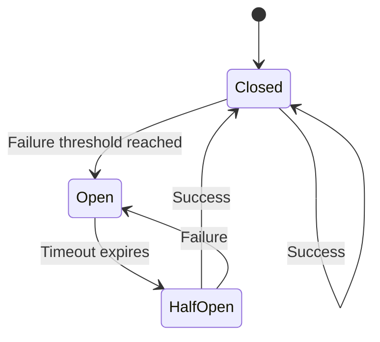
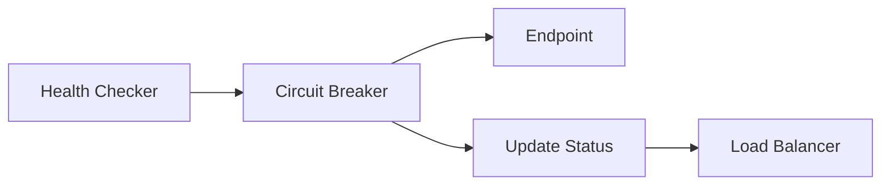

# Circuit Breaker

The circuit breaker pattern protects your LLM infrastructure by automatically isolating failing endpoints and allowing them to recover.

> :memo: **Default Configuration**
> ```yaml
> # Circuit breaker settings (hardcoded for reliability)
> # Health checker failure threshold:  3 consecutive failures
> # Olla proxy failure threshold:      5 consecutive failures
> # Timeout: 30 seconds
> # Half-open test: 1 request
> ```
> **Key Settings**:
>
> - Health checker circuit breaker opens after 3 consecutive transport failures
> - Olla proxy circuit breaker opens after 5 consecutive transport failures (higher tolerance)
> - Both wait 30 seconds before testing recovery
> - One successful request in half-open state closes the circuit
>
> **Note**: These values are currently hardcoded and not configurable via YAML or environment variables.

## How It Works

Olla implements a circuit breaker for each endpoint to prevent cascading failures:



### States

**Closed (Normal Operation)**

- Requests flow normally to the endpoint
- Failures are tracked
- Transitions to Open when failure threshold exceeded

**Open (Circuit Tripped)**

- All requests immediately fail without contacting endpoint
- Allows the endpoint time to recover
- Automatically transitions to Half-Open after timeout

**Half-Open (Testing Recovery)**

- Limited requests allowed through to test recovery
- Success transitions back to Closed
- Failure returns to Open state

## Implementation Details

There are two separate circuit breaker implementations — one in the health checker and one embedded in the Olla proxy engine:

**Health-checker circuit breaker** (`internal/adapter/health/circuit_breaker.go`):

```go
type CircuitBreaker struct {
    endpoints        *xsync.Map[string, *circuitState]
    failureThreshold int    // DefaultCircuitBreakerThreshold = 3
    timeout          time.Duration // DefaultCircuitBreakerTimeout = 30s
}

type circuitState struct {
    failures    int64 // atomic
    lastFailure int64 // atomic nanoseconds
    lastAttempt int64 // atomic nanoseconds (half-open sentinel)
    isOpen      int32 // atomic: 0=closed, 1=open
}
```

**Olla-proxy circuit breaker** (`internal/adapter/proxy/olla/service.go`): a separate unexported type with a three-state model:

```go
type circuitBreaker struct {
    failures    int64 // atomic
    lastFailure int64 // atomic nanoseconds
    state       int64 // atomic: 0=closed, 1=open, 2=half-open
    threshold   int64 // circuitBreakerThreshold = 5
}
```

### Configuration

Circuit breaker parameters are currently hardcoded in the implementation:

| Parameter | Value | Description |
|-----------|-------|-------------|
| **Failure Threshold (health checker)** | 3 consecutive failures | Trips the health-checker circuit |
| **Failure Threshold (Olla proxy)** | 5 consecutive failures | Trips the proxy-layer circuit |
| **Timeout** | 30 seconds | Time before testing recovery |
| **Half-Open Tests** | 1 successful request | Required to close circuit |

### Failure Detection

The circuit breaker tracks these failure conditions:

- Connection timeouts
- Request timeouts
- Connection refused errors
- DNS resolution failures
- Other transport-layer errors

!!! note "HTTP 5xx responses"
    HTTP 5xx responses from the backend do **not** currently trip the circuit breaker. Only transport-layer failures (connection errors, timeouts) cause the counter to increment. Wiring 5xx responses into the circuit breaker is tracked in [issue #144](https://github.com/thushan/olla/issues/144).

### Recovery Process

1. After 30 seconds in Open state, transitions to Half-Open
2. One request is allowed through as a test
3. If that request succeeds, the circuit closes immediately
4. Any failure returns to Open state

## Integration with Health Checking

The circuit breaker works alongside health checking:



- Health checks respect circuit breaker state
- Open circuits mark endpoints as unhealthy
- Load balancer avoids unhealthy endpoints
- Closed circuits allow normal health checking

## Observability

### Metrics

Circuit breaker state is tracked internally and affects:

- Endpoint health status in `/internal/status`
- Request routing decisions
- Structured logging

### Status Endpoint

The `/internal/status` endpoint shows endpoint health which reflects circuit breaker state:

```json
{
  "endpoints": [
    {
      "name": "local-ollama",
      "status": "unhealthy",
      "issues": "circuit breaker open"
    }
  ]
}
```

## Best Practices

### Tuning for Your Environment

While parameters are hardcoded, you can influence behaviour through:

1. **Health Check Intervals**: More frequent checks detect issues faster
2. **Request Timeouts**: Shorter timeouts trigger circuit breaker sooner
3. **Endpoint Priorities**: Route away from flaky endpoints

### Monitoring

Watch for these patterns:

- Frequent circuit trips indicate endpoint instability
- Long recovery times suggest capacity issues
- Cascading trips may indicate broader problems

### Testing Circuit Breakers

Test your circuit breaker behaviour:

```bash
# Simulate endpoint failure
docker stop ollama-instance

# Watch circuit breaker activate
curl http://localhost:40114/internal/status

# Restart endpoint
docker start ollama-instance

# Monitor recovery
watch -n 1 curl http://localhost:40114/internal/status
```

## Limitations

Current implementation limitations:

- Parameters not configurable via YAML
- No per-endpoint customisation
- The Olla proxy publishes a `circuit_breaker.open` event on the internal eventbus when a circuit opens; there are no external webhooks
- HTTP 5xx responses do not trip the circuit breaker (issue #144)

## Future Enhancements

Planned improvements:

- Configurable thresholds and timeouts
- Per-endpoint circuit breaker settings
- Circuit breaker events for monitoring
- Adaptive thresholds based on load
- Manual circuit breaker control API

## Related Documentation

- [Health Checking](../concepts/health-checking.md) - Endpoint monitoring
- [Load Balancing](../concepts/load-balancing.md) - Request distribution
- [Architecture Overview](overview.md) - System design

## Technical Reference

For implementation details, see:

- `internal/adapter/health/circuit_breaker.go` - Health-checker circuit breaker (threshold 3)
- `internal/adapter/health/checker.go` - Integration with health checking
- `internal/adapter/proxy/olla/service.go` - Olla proxy circuit breaker (threshold 5)
- `internal/adapter/health/types.go` - Shared constants (`DefaultCircuitBreakerThreshold`, `DefaultCircuitBreakerTimeout`)
- `internal/adapter/balancer/` - Load balancer integration